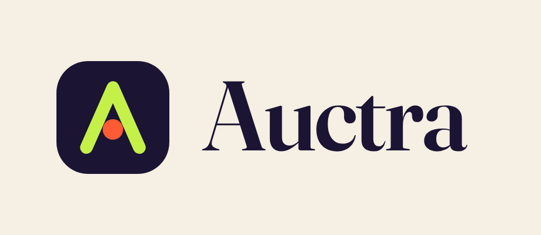
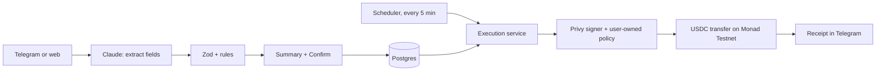

<p align="center">
  
</p>

<h3 align="center">Money that moves itself.</h3>

<p align="center">
  Tell Auctra what your money should do, in one sentence. It confirms the details, then pays, saves and sweeps USDC on schedule, inside limits only you can change.
</p>

<p align="center">
  <a href="https://auctra-fp4i.vercel.app"><b>Live app</b></a> ·
  <a href="#try-it-in-3-minutes">Try it</a> ·
  <a href="docs/PRD.md">Product spec</a> ·
  <a href="docs/DESIGN.md">Design system</a>
</p>

<p align="center">
  <b>Monad Metropolis Hackathon</b> · Runs on <b>Monad Testnet</b> (chain 10143) with test USDC
</p>

---

## In one line

Auctra is an AI money agent you talk to in Telegram or on the web. You say what your money should do, it shows you the exact transfer, and after you confirm it runs on schedule from your own wallet on Monad, without ever holding your keys.

## Try it in 3 minutes

1. Open the [live app](https://auctra-fp4i.vercel.app) and tap **Start in Telegram**, or sign in on the web with email.
2. Pick **Personal** or **Business**. Auctra creates your wallet and asks you to approve its spending limits.
3. Get test funds: MON for fees from the [Monad faucet](https://faucet.monad.xyz) and test USDC from [Circle's faucet](https://faucet.circle.com) (choose Monad Testnet).
4. Save a destination, for example any address named **Savings**.
5. Type: *"Save 20 USDC to my savings wallet every Friday at 6 PM."*
6. Check the summary and tap **Confirm**.
7. Open the automation and press **Run now** to see it send right away. The receipt links to the transaction on the Monad Testnet explorer.

In Telegram, `/balance`, `/automations`, `/destinations` and `/history` show the same data as the dashboard.

## The problem

Recurring money tasks are easy to describe and tedious to do: save every Friday, pay rent on the 1st, pay a contractor weekly, keep a reserve topped up. Crypto wallets make you click through every one of them by hand, and AI agents that could do it usually ask for your keys.

## What Auctra does

1. **Understands it.** Claude extracts the amount, recipient, schedule and any condition. Nothing else.
2. **Shows it back.** You see the exact transfer as plain fields and tap **Confirm**. Nothing runs before that.
3. **Runs it.** On schedule, Auctra checks your balance and limits, sends the USDC from your own wallet, and messages you a receipt.

It works for people (savings, rent, balance floors) and for small businesses (vendors, contractors, reserve sweeps, memos and CSV export).

Example requests it understands:

- *Save 20 USDC to my savings wallet every Friday at 6 PM*
- *Pay Acme Hosting 80 USDC on the 1st of every month at 09:00, memo INV hosting*
- *Send 50 USDC to my reserve every Monday at 10:00 only if my balance is at least 500*

## Why Monad

- **Small, frequent transfers need cheap, fast blocks.** A weekly 20 USDC saving only makes sense when fees are tiny and the receipt arrives in seconds. Monad gives both.
- **It's EVM.** Standard USDC, viem and Privy's embedded wallets work as they are, with no custom contracts needed.
- **Every run is verifiable.** Each execution stores its transaction hash and links to the Monad Testnet explorer.

## Why it's safe

- **Your keys stay yours.** Wallets are Privy embedded wallets owned by the user. Auctra never sees a seed phrase or private key.
- **Limits enforced twice.** Per-transfer (100 USDC) and daily (250 USDC) caps are checked by Auctra, then again by a Privy policy the user owns. Auctra can't raise its own limits.
- **Saved recipients only.** Money can only go to destinations the user saved and confirmed.
- **AI never moves money.** The model only fills in fields. Validation, scheduling and execution are deterministic code.
- **Every run has an answer.** Each execution ends as sent, skipped or blocked, with the reason and the transaction hash.
- **Testnet only.** CI fails on any Monad mainnet reference.

## What's working

| | |
|---|---|
| Plain-language automations | One-time, daily, weekly and monthly schedules, timezones and DST, "only if balance is at least" conditions, memos |
| Telegram bot | Sign in, create and confirm automations, balances, history, receipts after every run |
| Web dashboard | Automations with pause, resume, cancel and Run now; destinations; activity with CSV export; settings |
| Wallets | Privy embedded wallets with a session signer and a user-owned spending policy |
| Scheduler | Checks for due automations every 5 minutes; each run has a unique key so it can never send twice |
| Accounts | Personal and Business, with business name and destination categories |

## How it works



Each execution moves through reserve, preflight, submit and confirm, with a unique execution key so a run can never send twice.

## Built with

| | |
|---|---|
| App | Next.js 16 (App Router), React 19, Tailwind CSS 4 |
| AI | Claude via the Anthropic SDK (intent extraction only) |
| Wallets | Privy embedded wallets, session signers and policies |
| Chain | Monad Testnet, USDC, viem |
| Data | Neon Postgres, Drizzle ORM |
| Bot | Telegram Bot API and Mini App |
| Hosting | Vercel, GitHub Actions scheduler |
| Tests | Vitest with in-memory Postgres (PGlite), 147 tests |

## Run it locally

```sh
npm install
cp .env.example .env.local   # fill in the values below
npm run db:migrate
npm run dev
```

| Variable | What it's for |
|---|---|
| `DATABASE_URL` | Neon Postgres connection string |
| `ANTHROPIC_API_KEY` | Claude, for reading requests |
| `NEXT_PUBLIC_PRIVY_APP_ID`, `PRIVY_APP_SECRET` | Privy app |
| `PRIVY_AUTHORIZATION_PRIVATE_KEY`, `PRIVY_SIGNER_ID` | Auctra's session signer (`npm run spike -- keygen`) |
| `TELEGRAM_BOT_TOKEN`, `TELEGRAM_WEBHOOK_SECRET`, `TELEGRAM_BOT_USERNAME` (or `NEXT_PUBLIC_TELEGRAM_BOT_USERNAME`) | Telegram bot |
| `CRON_SECRET` | Protects the scheduler endpoint |
| `NEXT_PUBLIC_APP_URL` or `APP_URL` | Public URL, used for links and social previews (defaults to the Vercel production URL) |
| `AUCTRA_NETWORK`, `MONAD_CHAIN_ID`, `MONAD_RPC_URL` | `testnet`, `10143`, Monad Testnet RPC |

Privy key quorum details are in [docs/spike.md](docs/spike.md) and the comments in [.env.example](.env.example). The wallet needs testnet MON for gas and test USDC from Circle's faucet.

### Telegram

1. Create the bot with [@BotFather](https://t.me/BotFather), then send it `/setdomain` with your app's domain so Telegram login works.
2. In Vercel, add `TELEGRAM_BOT_TOKEN`, `TELEGRAM_WEBHOOK_SECRET` (any long random string) and `TELEGRAM_BOT_USERNAME`, then redeploy.
3. In Privy, turn on Telegram login with the same bot token and name.
4. Open `https://<your-app>/api/telegram/setup` once. It connects the webhook and sets the bot's description, commands and Open button.

### Scheduler

Vercel's free plan only runs crons once a day, so [.github/workflows/scheduler.yml](.github/workflows/scheduler.yml) calls `/api/cron/execute` every 5 minutes. Add a GitHub repository secret named `CRON_SECRET` with the same value as in Vercel. Set the `APP_URL` repository variable if your app isn't at the default URL.

### Checks

```sh
npm run check:testnet   # fails on any Monad mainnet reference
npm run lint            # typed routes + typecheck
npm test                # unit and integration tests
npm run build
```

CI runs all four on every push.

## Project map

| Area | Where |
|---|---|
| Pages and dashboard | `app/`, `components/` |
| API routes | `app/api/` |
| Intent parser (Claude) | `lib/ai/intent-parser.ts` |
| Schedules (timezones, DST, month end) | `lib/schedule.ts` |
| Accounts, destinations, automations | `lib/services/` |
| Execution state machine | `lib/services/executions.ts` |
| Wallet boundary and policy | `lib/wallet/` |
| Telegram bot | `lib/telegram/` |
| Database schema and migrations | `db/schema.ts`, `drizzle/` |

## Docs

- [PRD.md](docs/PRD.md): the product spec
- [CHANGES.md](docs/CHANGES.md): every implementation decision against the spec
- [DESIGN.md](docs/DESIGN.md): colors, type and components
- [FEASIBILITY-privy-monad.md](docs/FEASIBILITY-privy-monad.md) and [spike.md](docs/spike.md): Privy on Monad Testnet, and the live check

## Status

Hackathon build. Testnet only, test USDC only, not financial advice.
