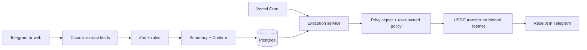

<p align="center">
  
</p>

<h3 align="center">Money that moves itself.</h3>

<p align="center">
  Tell Auctra what your money should do, in one sentence. It confirms the details, then pays, saves and sweeps USDC on schedule, inside limits only you can change.
</p>

<p align="center">
  <a href="https://auctra-fp4i.vercel.app"><b>Live app</b></a> ·
  <a href="#demo">Demo script</a> ·
  <a href="docs/PRD.md">Product spec</a> ·
  <a href="docs/DESIGN.md">Design system</a>
</p>

---

## The problem

Recurring money tasks are easy to describe and tedious to do: save every Friday, pay rent on the 1st, pay a contractor weekly, keep a reserve topped up. Crypto wallets make you click through every one of them by hand, and "AI agents" that could do it usually ask for your keys.

## What Auctra does

You type a request like **"Save 20 USDC to my savings wallet every Friday at 6 PM"** in Telegram or on the web. Auctra:

1. **Understands it.** Claude extracts the amount, recipient, schedule and any condition. Nothing else.
2. **Shows it back.** You see the exact transfer as plain fields and tap **Confirm**. Nothing runs before that.
3. **Runs it.** On schedule, Auctra checks your balance and limits, sends the USDC from your own wallet, and messages you a receipt.

It works for people (savings, rent, balance floors) and for small businesses (vendors, contractors, reserve sweeps).

## Why it's safe

- **Your keys stay yours.** Wallets are Privy embedded wallets owned by the user. Auctra never sees a seed phrase or private key.
- **Limits enforced twice.** Per-transfer and daily caps are checked by Auctra, then again by a Privy policy the user owns. Auctra can't raise its own limits.
- **Saved recipients only.** Money can only go to destinations the user saved and confirmed.
- **AI never moves money.** The model only fills in fields. Validation, scheduling and execution are deterministic code.
- **Every run has an answer.** Each execution ends as sent, skipped or blocked, with the reason and the transaction hash.
- **Testnet only.** Monad Testnet (chain 10143) and test USDC. CI fails on any mainnet reference.

## How it works



Each execution moves through reserve, preflight, submit and confirm, with a unique execution key so a run can never send twice.

## Built with

| | |
|---|---|
| App | Next.js 16 (App Router), React 19, Tailwind CSS 4 |
| AI | Claude via the Anthropic SDK (intent extraction only) |
| Wallets | Privy embedded wallets, session signers and policies |
| Chain | Monad Testnet, USDC, viem |
| Data | Neon Postgres, Drizzle ORM |
| Bot | Telegram Bot API and Mini App |
| Hosting | Vercel, Vercel Cron |
| Tests | Vitest with in-memory Postgres (PGlite), 140 tests |

## Demo

1. Open Auctra in Telegram or at the live app and sign in.
2. Pick Personal or Business, create the wallet, save a "Savings" destination and approve the limits.
3. Send: *"Save 20 USDC to my savings wallet every Friday at 6 PM."*
4. Check the summary and confirm.
5. On the dashboard, open the automation and press **Run now**.
6. Open the transaction in the Monad Testnet explorer, then see the receipt in Telegram.

## Run it locally

```sh
npm install
cp .env.example .env.local   # fill in the values below
npm run db:migrate
npm run dev
```

| Variable | What it's for |
|---|---|
| `DATABASE_URL` | Neon Postgres connection string |
| `ANTHROPIC_API_KEY` | Claude, for reading requests |
| `NEXT_PUBLIC_PRIVY_APP_ID`, `PRIVY_APP_SECRET` | Privy app |
| `PRIVY_AUTHORIZATION_PRIVATE_KEY`, `PRIVY_SIGNER_ID` | Auctra's session signer (`npm run spike -- keygen`) |
| `TELEGRAM_BOT_TOKEN`, `TELEGRAM_WEBHOOK_SECRET`, `TELEGRAM_BOT_USERNAME` (or `NEXT_PUBLIC_TELEGRAM_BOT_USERNAME`) | Telegram bot |
| `CRON_SECRET` | Protects the scheduler endpoint |
| `NEXT_PUBLIC_APP_URL` or `APP_URL` | Public URL, used for links and social previews (defaults to the Vercel production URL) |
| `AUCTRA_NETWORK`, `MONAD_CHAIN_ID`, `MONAD_RPC_URL` | `testnet`, `10143`, Monad Testnet RPC |

Full setup (Privy key quorum, Telegram webhook, Vercel) is in [docs/spike.md](docs/spike.md) and the comments in [.env.example](.env.example). The wallet needs testnet MON for gas and test USDC from Circle's faucet.

### Checks

```sh
npm run check:testnet   # fails on any Monad mainnet reference
npm run lint            # typed routes + typecheck
npm test                # unit and integration tests
npm run build
```

CI runs all four on every push.

## Project map

| Area | Where |
|---|---|
| Pages and dashboard | `app/`, `components/` |
| API routes | `app/api/` |
| Intent parser (Claude) | `lib/ai/intent-parser.ts` |
| Schedules (timezones, DST, month end) | `lib/schedule.ts` |
| Accounts, destinations, automations | `lib/services/` |
| Execution state machine | `lib/services/executions.ts` |
| Wallet boundary and policy | `lib/wallet/` |
| Telegram bot | `lib/telegram/` |
| Database schema and migrations | `db/schema.ts`, `drizzle/` |

## Docs

- [PRD.md](docs/PRD.md): the product spec
- [CHANGES.md](docs/CHANGES.md): every implementation decision against the spec
- [DESIGN.md](docs/DESIGN.md): colors, type and components
- [FEASIBILITY-privy-monad.md](docs/FEASIBILITY-privy-monad.md) and [spike.md](docs/spike.md): Privy on Monad Testnet, and the live check

## Status

Hackathon build. Testnet only, test USDC only, not financial advice.
